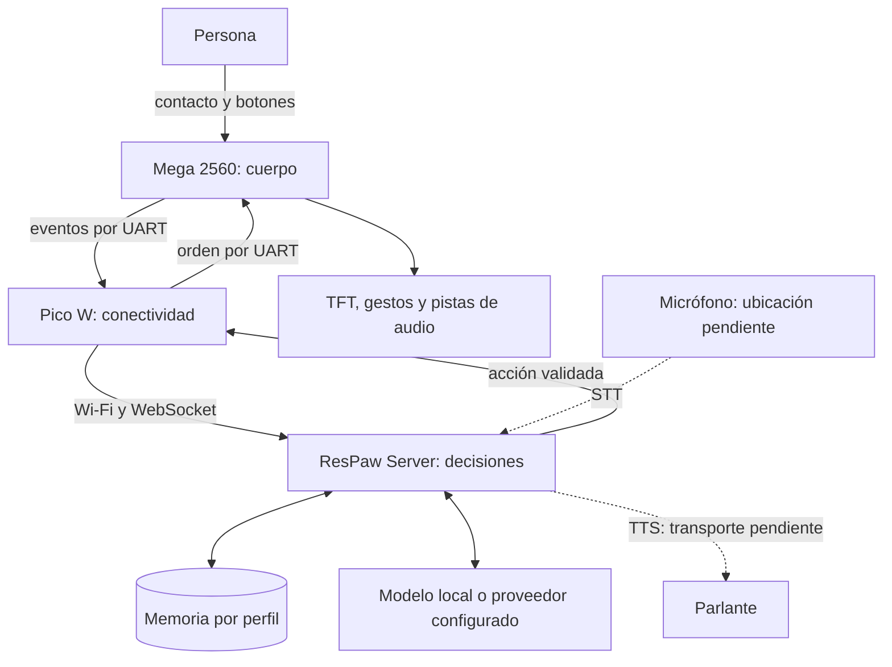
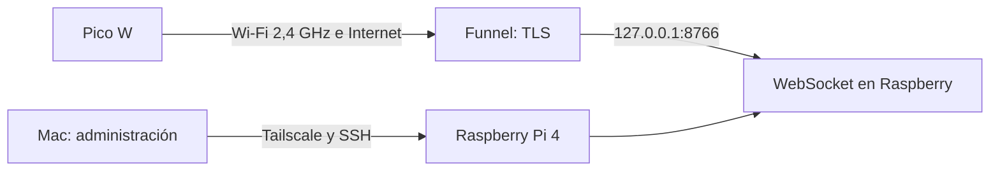

# Arquitectura de ResPaw

ResPaw busca conversar con una persona, recuperar recuerdos autorizados entre
sesiones y reaccionar físicamente a sus interacciones. El software del servidor
es el «companion»: no es una placa adicional. El objetivo se organiza en tres
responsabilidades, que pueden evolucionar sin trasladar el modelo al robot.



Las flechas representan la arquitectura objetivo. La tabla siguiente diferencia
el código existente de las conexiones que todavía deben completarse.

## Implementación y evidencia

| Componente | Estado | Qué hace realmente |
| --- | --- | --- |
| Companion, `companion/respaw/` | Implementado y desplegado | Ollama local o GPT explícito; sesiones; memoria SQLite/FTS y embeddings locales opcionales; corrección y olvido; transporte `NetworkRobot` |
| Interfaz del companion | Implementado, local | HTTP en `127.0.0.1:8765`; token de sesión y comprobación de origen; perfiles sin autenticación de cuentas remotas |
| Mega v2, `mega2560/source/respaw-v2/` | Cargado; protocolo USB físico comprobado | TFT, FSR, MAX30102 y DFPlayer; órdenes por USB y Serial1 con buffers separados, propietario por PING y contacto A8; montaje UART y gesto observado pendientes |
| Pico v2, `pico/source/respaw-v2/` | Implementado | Receptor UART con límites, validación y caducidad; consola USB; Wi-Fi desactivado |
| Servidor de enlace, `tools/robot_link_server.py` | Implementado y desplegado en Raspberry | WebSocket autenticado; identificación del Pico; latidos; eventos y órdenes de prueba. No ejecuta conversación ni guarda recuerdos |
| Pico gateway, `pico/source/respaw-gateway/` | Instalado; Wi-Fi físico pendiente de setup | Configuración Wi-Fi y enlace WSS. La guía del gateway y el informe de verificación distinguen pruebas de implementación |
| Mega ↔ Pico bidireccional | Código integrado; montaje pendiente | TX del gateway requiere habilitación explícita, capacidad del Mega y PING confirmado; los IDs y ACK están correlacionados |
| Contacto → evento → decisión → gesto | Código integrado; prueba física pendiente | Opción por sesión «Responder al contacto»: presión nueva y fresca solicita `FACE listening` sin GPT, voz ni memoria; contexto físico actual para conversación aparte |
| Proveedor de conversación en nube | Credencial instalada; GPT real verificado | Dos turnos gpt-4o-mini y recuperación de memoria con SQLite temporal; Responses con esquema estricto y `store:false`; no cambia automáticamente a Ollama |
| Voz completa en el robot | TTS y STT en nube comprobados con audio sintético | /api/speak generó MP3 ElevenLabs y /api/transcribe pasó por la API de producción; micrófono físico, ciclo hablado y transporte al parlante del robot pendientes |

Las [verificaciones de septiembre](verificacion-pico-2026-09-14.md) validan el
firmware v2 instalado entonces, no esta arquitectura completa. La captura del
3 de octubre confirmó el Pico W `e66368254f3e912e`, MicroPython 1.26.1 y los tres
archivos v2 coincidentes con el repositorio antes de actualizarlo.

## Responsabilidades

El **Mega** interpreta los sensores y ejecuta acciones físicas acotadas. Debe
mantener el control local cuando el servidor desaparece. Conserva las rutinas
de dibujo y las pistas del DFPlayer; no necesita ejecutar un LLM. Una orden
`FACE` identifica una expresión, no una secuencia de píxeles.

El **Pico W** configura su Wi-Fi, mantiene el enlace, identifica el dispositivo
y transporta eventos y acciones. No guarda la memoria conversacional ni lleva
credenciales del proveedor de IA. Debe limitar sus colas y mensajes para seguir
leyendo UART aunque falle la red. Su radio admite Wi-Fi de **2,4 GHz**; la
configuración debe usar una red compatible. [Documentación de Raspberry Pi](https://www.raspberrypi.com/documentation/microcontrollers/pico-series.html).

El **servidor** asocia el robot con una sesión y un perfil, recupera recuerdos,
obtiene una respuesta y valida sus acciones antes de enviarlas. Puede vivir en
una PC o Raspberry local, o ser accesible por Internet. Usar un modelo remoto
no obliga a trasladar la memoria SQLite a ese proveedor: se envía el contexto
del turno que se decida utilizar. Esta opción debe seleccionarse de forma
explícita; la aplicación offline no cambia de proveedor automáticamente.

La Raspberry Pi 4 de esta instalación tiene 4 GB de RAM y corre Python 3.13.5.
Puede alojar la coordinación, WebSocket y SQLite. El modelo de conversación en
nube es una opción para no exigir inferencia de un modelo grande a esa placa.
El servicio de enlace es independiente del companion existente.

## Comunicación y cableado

El vocabulario del Mega v2 se conserva por **USB** y **Serial1**:

```text
V1 1 PING
V1 2 FACE warm
V1 3 STOP
```

Cada puerto tiene su buffer y recibe sus propias respuestas. PING adquiere un
controlador por seis segundos; STOP funciona desde ambos puertos. Contacto y
telemetría son eventos aparte. El Pico recibe en UART0/GP1 y conserva GP0 como
entrada salvo habilitación explícita y capacidad confirmada del nuevo Mega.
La placa física tiene el nuevo Mega v2 tras respaldar el firmware autónomo,
EEPROM y configuración. La carga y el protocolo USB se comprobaron en la
placa; el usuario confirmó que no hay cables UART entre las placas. Conectar
dos USB a una computadora no une sus UART.

| Señal | Montaje receptor v2 | Cambio bidireccional pendiente |
| --- | --- | --- |
| Mega TX1/D18 → Pico RX0/GP1, pin físico 2 | Adaptación de 5 V a 3,3 V | Conservar adaptación y comprobar recepción física |
| Pico TX0/GP0, pin físico 1 → Mega RX1/D19 | GP0 liberado | Confirmar montaje y habilitar `uart_commands` tras cargar Mega v2 |
| Tierra | GND común | Necesaria en ambos sentidos |

No conectar una salida de 5 V a un GPIO del Pico. El montaje y las referencias
del adaptador se detallan en la [guía del receptor v2](../pico/source/respaw-v2/README.md).
Los archivos originales recuperados y el sketch de tesis se conservan como
evidencia; no representan el nuevo gateway.

## Protocolo mínimo

Un objeto JSON por mensaje WebSocket, versión entera `v:1`, con tamaño máximo
de 512 bytes. El robot abre `/robot`, se autentica con una credencial propia
y envía `hello` con su `robot_id`. La credencial del robot y cualquier clave de
IA se mantienen fuera de Git. El operador del servidor usa un puerto separado
de loopback, accesible por SSH; no se publica junto al enlace del robot.

```json
{"v":1,"type":"hello","robot_id":"e66368254f3e912e","transport":"wifi"}
{"v":1,"type":"heartbeat","id":2,"command_ready":true}
{"v":1,"type":"action","id":1,"command":"FACE","argument":"warm"}
```

Se conserva el vocabulario del Mega: `neutral`, `warm`, `listening`, `thinking`
y `sleeping`. `FACE:HAPPY`, `FACE:BLINK` y `TOUCH:HEAD` de la conversación de
diseño eran ejemplos, no órdenes existentes. El codificador
`pico/source/respaw-v2/link_protocol.py` transforma una acción válida en
`V1 1 FACE warm\n`; validar esa línea no la envía ni confirma su ejecución.

Un evento de UART se transporta dentro de `event` conservando versión y
validez. Las pruebas con mensajes inventados se marcan `source:synthetic`;
las lecturas físicas se marcan `source:uart`. El contacto contiene
`sensor:"fsr_a8"`, `pressed` booleano y `uptime_ms`; no atribuye una ubicación
corporal que el montaje no haya confirmado ni infiere emociones.

Las confirmaciones deben describir lo ocurrido: **validada**, **enviada a UART**,
**aceptada por el Mega** o **finalizada** son estados diferentes. `forwarded`
no termina una solicitud: `mega_accepted` requiere el ACK correlacionado del
Mega. Sin TX habilitado, el gateway devuelve un error. El `ack` del Mega
confirma aceptación, y no ofrece deduplicación de acciones persistentes.

## Redes distintas y reconexión

La Raspberry está en la red de Católica y el Pico en otra red. Tailscale en la
Mac y la Raspberry permite administrarlas, pero el Pico no participa en esa
VPN. Se prepara un endpoint WSS mediante Funnel, con el mismo protocolo que
usaría una conexión LAN. TLS termina en Funnel y se verifica desde el Pico.



WebSocket usa TCP, que entrega los bytes en orden. Aun así, una caída completa
necesita reconexión, nuevo `hello` y actualización de estado. El servidor usa
ping/pong y el gateway reintenta con espera acotada. No se reproducen gestos
viejos ni se reintentan a ciegas acciones después de reconectar. La deduplicación
y confirmación duradera deberán añadirse antes de soportar cambios persistentes.
[Referencia de WebSocket y keepalive](https://websockets.readthedocs.io/en/15.0.1/topics/keepalive.html).

Si no hay configuración válida de Wi-Fi, el Pico presenta una red de setup y
una página local para configurar SSID y contraseña desde el celular. El portal
manual funciona sin Internet; la apertura automática como portal cautivo requiere
pruebas adicionales en iOS/Android. TLS necesita una CA de confianza y un reloj
válido; un fallo de verificación no debe activar una conexión insegura.

## Memoria, desconexión y próximos hitos

La memoria actual pertenece al perfil del servidor y se guarda solo al elegir
«Recordar este mensaje». El modo invitado y el historial corriente viven en
RAM. El Pico conserva telemetría temporal, no recuerdos. Un contacto no se
convierte automáticamente en memoria. Consultar el [acompañante local](offline-companion.md)
y el [acompañante GPT en Raspberry](companion-raspberry.md).

«Responder al contacto» requiere consentimiento explícito en una sesión y un
robot real con capacidad de órdenes y enlace listo. El servidor conserva solo
el último pulso en RAM, con ID efímero y antigüedad máxima de dos segundos;
agrupa ráfagas y usa el pulso presente como estado inicial al armar. Una presión
nueva solicita `FACE listening` con cancelación, sin consultar el modelo ni
guardar memoria. STOP, otra sesión, pérdida de disponibilidad o 30 segundos
sin presencia de la web desarman la opción. Una generación de consentimiento
rechaza activaciones anteriores a esos cambios; la UI también descarta sus
respuestas tardías. Volver a conectar no reactiva el consentimiento.

El Mega v2 detiene medición y audio si desaparecen los PING después de haberse
conectado al host. El firmware `respaw-autonomo` es otra alternativa instalada
por separado: ofrece interacción guiada y preferencias en EEPROM; no es un
fallback que el v2 pueda cargar solo ni conversación libre sin servidor.

El orden de integración es: enlace real Pico ↔ servidor; UART bidireccional
con el Mega; evento de contacto y gesto confirmado; conexión del companion y
su memoria; proveedor de IA y voz. Los criterios verificables están en el
[roadmap](ROADMAP.md).

La [guía del servidor](server-link.md) describe el despliegue en la Raspberry.
El [informe del 3 de octubre](verificacion-enlace-2026-10-03.md) registra las
pruebas realizadas y el paso de configuración Wi-Fi pendiente.
