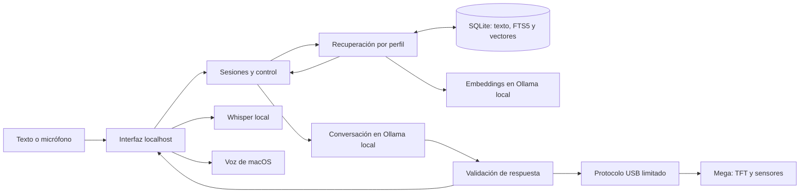

# Acompañante local

Esta versión añade conversación libre en español y recuerdos entre sesiones al
archivo recuperado de ResPaw. La Mac ejecuta el modelo y conserva la memoria. El
Mega 2560 controla la TFT de 3,5 pulgadas, el MAX30102, el FSR y el DFPlayer. El
Pico no es necesario para probar esta primera versión.

**Offline no significa que este modelo corra dentro del Mega.** Esta web usa la
Mac. Para el objetivo de no añadir hardware ni depender de ella, se incorpora un
[firmware autónomo](../mega2560/source/respaw-autonomo/README.md) con interacción
por presión, indicaciones en la TFT y preferencias persistentes. Ese firmware
ofrece acompañamiento guiado; no ejecuta el modelo de conversación.

El [receptor del Pico W](../pico/source/respaw-v2/README.md) está disponible como
componente opcional: recibe telemetría del Mega por UART y permite observarla
en su consola USB. Requiere cableado entre placas con adaptación de nivel de
5 V a 3,3 V; los dos USB separados no establecen ese enlace. La conversación y
su memoria siguen funcionando en la Mac.

## Preparación en la Mac

Requisitos: Python 3.11 o posterior con SQLite FTS5 y Ollama instalado. No hay
dependencias Python adicionales para conversar por texto. Ejecutar los comandos
desde la raíz de este repositorio.

La preparación inicial necesita Internet y espacio para unos 2,5 GB de modelo
de conversación y 639 MB de modelo de memoria, más herramientas y voz opcionales. Después, la aplicación
funciona con los archivos instalados y un servidor Ollama local. No descarga
modelos al conversar ni cambia a un proveedor remoto si algo falla.

En una terminal, iniciar Ollama con almacenamiento separado:

```sh
mkdir -p "$HOME/Library/Application Support/ResPaw/models"
env OLLAMA_HOST=127.0.0.1:11434 \
  OLLAMA_MODELS="$HOME/Library/Application Support/ResPaw/models" \
  OLLAMA_NO_CLOUD=1 OLLAMA_NUM_PARALLEL=1 ollama serve
```

Si ya hay un servidor en ese puerto, usar su instalación local o elegir otro
puerto y pasarlo a la aplicación con `--ollama`. La variable de almacenamiento
debe configurarse en el proceso **servidor**, no solamente en `ollama pull`.

En otra terminal, descargar el modelo una sola vez y abrir la aplicación:

```sh
ollama pull qwen3:4b-instruct-2507-q4_K_M
ollama pull qwen3-embedding:0.6b
make run
```

Abrir <http://127.0.0.1:8765>. El proceso queda en primer plano y se detiene con
Ctrl+C. El modo predeterminado simula la cara y no abre puertos serie.

Opciones, sin editar el código:

```sh
PYTHONPATH=companion python3 -m respaw --help
PYTHONPATH=companion python3 -m respaw --port 8766 --model qwen3:4b-instruct-2507-q4_K_M
PYTHONPATH=companion python3 -m respaw --no-semantic-memory
```

La búsqueda por significado se activa con el modelo de embeddings instalado.
Si falta o falla, continúa la búsqueda por palabras y contexto; no se descarga
nada automáticamente. El estado se muestra en los detalles de la aplicación.
`--embedding-model` selecciona otro modelo local y `--semantic-threshold` cambia
el filtro de similitud; el valor predeterminado `0.42` se probó con Qwen3 0.6B,
no es una probabilidad ni un umbral universal para otros modelos.

## Probar el recuerdo que motivó el cambio

1. Crear un perfil con un nombre o apodo.
2. Escribir, por ejemplo: «Estaba triste porque desaprobé mi examen de cálculo».
3. Pulsar **Recordar este mensaje** debajo de la intervención propia.
4. Pulsar **Comenzar otra conversación** y escribir «Hola, volví».
5. Inspeccionar **Recuerdos utilizados** en la respuesta.

El modelo recibe el episodio abierto para poder retomar el examen con tacto.
La frase concreta se genera: no hay una respuesta pregrabada para ese caso.
La calidad del lenguaje sigue dependiendo del modelo; la aplicación no puede
garantizar que siempre use bien el contexto.

En **Mis recuerdos** se puede corregir el texto, marcar un asunto como resuelto,
reabrirlo o borrarlo. Corregir y borrar reinicia el contexto de conversación
del perfil para que la versión anterior no reaparezca desde turnos en RAM.
Los asuntos resueltos siguen disponibles ante una pregunta relacionada, pero
no se ofrecen solo por saludar. El modo invitado no guarda recuerdos.

En cada recuerdo, **Tipo de recuerdo** permite elegir entre un episodio y una
preferencia, por ejemplo «Prefiero que solo me escuches, sin ejercicios».
**Guardar cambios** aplica la elección. Las preferencias activas tienen espacio
reservado en el contexto, hasta dos por respuesta; puedes pausarlas y reactivarlas.
Una preferencia pausada no se recupera aunque sus palabras coincidan con la pregunta.
La petición del turno actual tiene prioridad: se instruye al modelo para que
pueda dar ideas si ahora las pides, aunque antes prefirieras solo conversar.

Las actividades son propuestas que la persona elige; el modelo no las inicia
por su cuenta. **Detener** corta la voz, solicita STOP al robot y descarta una
respuesta pendiente. La inferencia que ya está ejecutando Ollama puede terminar
en segundo plano, aunque su respuesta ya no se muestre ni controle el robot.

## Voz sin servicios remotos

La lectura opcional usa la voz **Paulina** de macOS. Activar «Leer las respuestas
en voz alta» para escuchar respuestas. Esta voz debe estar instalada en el Mac.

Para transcribir, hacen falta CMake, un compilador C++ y FFmpeg. En macOS Apple
Silicon, el instalador descarga fuentes y modelo con SHA-256 fijado y compila
whisper.cpp con Metal:

```sh
python3 tools/setup_local.py --speech
make run
```

El instalador coloca `whisper.cpp 1.9.4` y el modelo multilingüe `base` fuera del
repositorio; la aplicación los detecta al arrancar. También se pueden especificar
instalaciones propias con `--whisper-cli` y `--whisper-model`.

**Hablar** graba hasta 30 segundos. Volver a pulsarlo termina la captura; la
transcripción aparece en el cuadro para revisarla antes de enviar. El navegador
pedirá acceso al micrófono. El audio temporal se elimina tras la transcripción.
Este flujo es por turnos: todavía no hay escucha continua, detección de fin de
turno ni interrupción automática al hablar encima de la voz del robot.

## Arquitectura y almacenamiento



La memoria combina coincidencias por palabras con BM25 y por significado con
Qwen3-Embedding 0.6B, usando fusión de rangos. Conserva hasta dos preferencias
activas y episodios abiertos recientes ante un saludo o recapitulación general
al comenzar una sesión. Si la primera intervención plantea otro tema, solo se
añaden los episodios coincidentes. Cada recuerdo conserva declaración original,
perfil, sesión de procedencia, fecha de guardado y estado. La API admite además
tema y fecha de evento explícita; la interfaz permite cambiar el tipo
`episode`/`preference` sin inferir fechas. Se entregan como máximo cuatro recuerdos al
modelo. Las decisiones y referencias están en el
[análisis del estado del arte](estado-del-arte-2026.md).

La sesión recuerda los ids de los episodios citados en la última respuesta.
Preguntas breves de seguimiento, como «¿Por qué me sentía así?», vuelven a leer
esos episodios de SQLite. Este mecanismo usa un vocabulario limitado de
referencias en español: no equivale a búsqueda semántica. Una respuesta que ya
no cita el episodio limpia ese contexto; corregir o borrar lo invalida en todas
las sesiones del perfil. Se comprueba el perfil también al recuperar por id.

La búsqueda semántica complementa ese seguimiento cuando la persona cambia las
palabras: por ejemplo, preguntar por «renta» puede recuperar «alquiler». Los
vectores se calculan solo para el perfil elegido y se reutilizan desde SQLite.
El índice incluye la versión del modelo y una firma del contenido; corregir,
pausar o borrar invalida sus vectores. Las consultas no se guardan en el índice.
Cada turno prepara como máximo 16 recuerdos pendientes; los siguientes turnos
completan el resto. Durante ese proceso FTS5 sigue cubriendo todos los recuerdos.
Un saludo o seguimiento breve usa el contexto y evita una inferencia semántica
innecesaria. **Detener** y **Olvidar** funcionan durante esa inferencia y una
respuesta tardía no puede restaurar un recuerdo borrado o corregido.

Los datos de la aplicación están en
`~/Library/Application Support/ResPaw/memory.sqlite3` en macOS, o en
`~/.local/share/respaw/` en otros sistemas. `--data-dir` cambia esa ubicación.
Los modelos y herramientas opcionales también quedan fuera de Git. La
conversación corriente se conserva en RAM, con contexto acotado, y desaparece
al cerrar el servidor. Solo los mensajes seleccionados se guardan en SQLite.

La interfaz escucha en loopback, exige un token de sesión de aplicación y no
carga recursos externos. Los perfiles separan la recuperación de recuerdos,
pero no son cuentas con contraseña: quien tenga acceso a esta sesión local de
la Mac puede seleccionar cualquiera. SQLite no está cifrado por la aplicación.
El borrado elimina la fila, la entrada de FTS y sus vectores; no borra copias que un sistema
de respaldo del equipo hubiera creado previamente.

## Mega por USB

El archivo recuperado se conserva. El nuevo sketch vive en
[`mega2560/source/respaw-v2`](../mega2560/source/respaw-v2/README.md).
Compilar no modifica la placa:

```sh
python3 tools/setup_local.py --arduino
make firmware
```

La conexión real requiere el nuevo firmware y `pyserial==3.5`. En un entorno
virtual que lo tenga instalado:

```sh
PYTHONPATH=companion python3 -m respaw --device /dev/cu.usbmodemPUERTO
```

Sustituir `PUERTO` por el puerto identificado del Mega. Abrir un puerto serie
puede reiniciar la placa. No se busca ni se abre automáticamente el Pico o el
Mega, ni se carga firmware desde esta aplicación. La conversación funciona
también si el robot está desconectado.

En esta Mac también se puede usar la dependencia ya preparada con `uv`, sin
descargar paquetes al arrancar:

```sh
PYTHONPATH=companion uv run --offline --with pyserial==3.5 python -m respaw --device /dev/cu.usbmodem14301
```

El puerto corresponde al Mega identificado durante la
[carga y prueba del 14 de septiembre](verificacion-hardware-2026-09-14.md).
Puede cambiar al reconectar la placa; comprobarlo con
`sh tools/arduino.sh board list`. Detener con Ctrl+C el servidor anterior antes
de iniciar otro en el mismo puerto web. Recargar la página después del reinicio.

## Verificación y alcance

```sh
make check
make firmware
PYTHONPATH=companion uv run --with playwright python tests/browser_smoke.py
PYTHONPATH=companion uv run --with playwright python tests/browser_smoke.py --live-model --semantic-memory
PYTHONPATH=companion python3 tools/eval_local.py --semantic-memory --output /tmp/respaw-eval.json
PYTHONPATH=companion python3 tools/eval_retrieval.py --output /tmp/respaw-retrieval.json
```

`make check` necesita Node para validar JavaScript y un compilador C++ para los
tests del núcleo del firmware. Las pruebas HTTP y de navegador crean servidores
locales y usan datos ficticios temporales. El navegador de prueba usa Chrome
instalado; Playwright solo es necesario para ese comando. `eval_local.py`
requiere el modelo real instalado y exporta respuestas y latencias: revisar la
fidelidad de esas respuestas además de los asserts.
`eval_retrieval.py` compara recuperación léxica e híbrida con ocho paráfrasis
en español y seis consultas sin relación, sin usar recencia ni un modelo de
conversación. Las pruebas de contrato usan vectores ficticios y no requieren
descargar los modelos.

Los PR hacia `main` ejecutan `make check` y el recorrido de navegador con
Chromium, datos ficticios y robot simulado. El artefacto **respaw-capturas**
incluye escritorio, móvil y controles de recuerdos para revisión durante
30 días, sin guardar imágenes generadas en Git. Este CI no descarga modelos
de conversación ni utiliza placas físicas. `--browser chromium` permite
reproducir ese recorrido con un navegador instalado mediante Playwright.
Los [resultados medidos en esta Mac](verificacion-local-2026-09-13.md) distinguen
las pruebas automáticas de las comprobaciones con modelo y voz reales.

Las pruebas automáticas cubren persistencia, separación entre perfiles,
corrección, resolución, olvido, cancelación y rechazo de acciones no permitidas.
El núcleo C++ comprueba intervalos, cálculo acotado, señal plana, temporizadores
y entradas serie largas con sanitizadores. Compilar para Mega comprueba librerías
y límites de memoria, pero no valida pantalla, cableado ni señal fisiológica.

Esta versión no implementa un diagnóstico de estrés,
ingesta de documentos arbitrarios, identificación de personas por cámara,
memoria autobiográfica automática ni diálogo de voz continuo. El siguiente
avance debe medirse con conversaciones reales consentidas: errores al recordar,
repeticiones, adaptación a cambios de tema y tiempo de respuesta.
